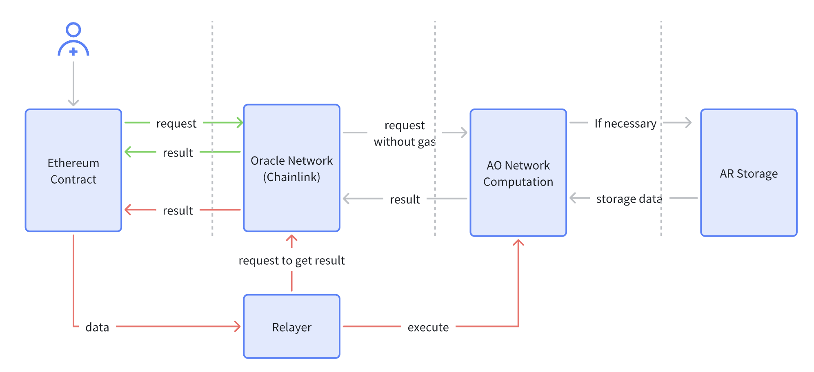
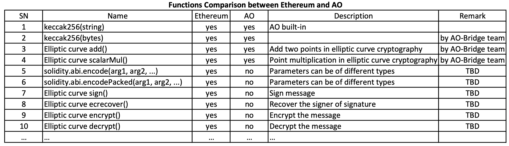

# AO-Bridge

# Abstract
Using AO’s computing power to undertake Ethereum’s computing tasks

# Motivation
Ethereum, the largest ecosystem, as knowns, there are still many shortcomings, especially the computations due to system limitations. And AO currently is the top leader in this decentralized calculations.

So, we combine the advantages of both, establish a connection. For the heavy tasks that require a lot of calculations on Ethereum, we complete them on AO, and return the calculation results to Ethereum.

This will have a very large influence not only for Ethereum, but also for AO ecosystem.

# Principles and Feasibility
## Principles and Feasibility
To connect the Ethereum and AO system, first we need a bridge. For security reasons, we use Chainlink to help us realize the bridge.

Chainlink can connect resources outside of Ethereum and write back to Ethereum. 

During implementation, firstly, user initiates an on-chain request on Ethereum, and here, we may need a relayer whose role is to calculate and store the calculation results on AO in advance, and the source data come from the request on Ethereum. Then Chainlink obtains the AO calculation results based on the parameters of request and put the result back to the Ethereum.

Rough flowchat shows as following:

## Another Infrastructure
In order to make the same calculation results of both system, AO needs to have functions related to Ethereum, especially the Elliptic Curve functions, so that it can seamlessly undertake the computing tasks of Ethereum.

We have checked the modules currently supported by AOS, but there is far from enough for Ethereum.

So the infrastructure need to be built simultaneously.

We summarize the main functions that Ethereum ecosystems need:

